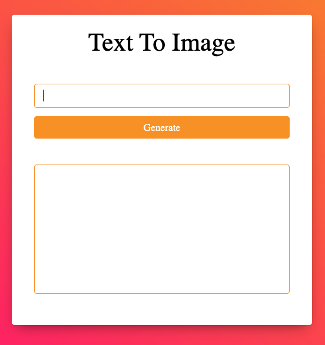

# Text To Image

Text To Image is an image generator from any text. Write any text you want to generate image from it.

## Screenshots

  
## Features

- Use of HTML5 canvas.
- The canvas element is a part of HTML5 and allows for dynamic, scriptable rendering of 2D shapes and bitmap images.